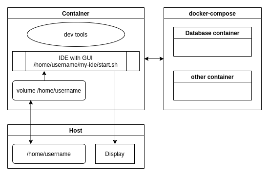

# IDE in Docker

* Images with development and GUI packages for running IDE inside docker
* Script to start IDE in container
* Docker-Compose environment with common services like database, queue, etc.



## Getting started

1. Clone/Download this repo
2. [Choose a tag](https://hub.docker.com/r/01e9/ide/tags) for your programming language
3. Start IDE in Docker

    `./ide {TAG} {IDE-script}`

    Example

    `./ide js ~/some-dir/webstorm/bin/webstorm.sh`

    **Important**: IDE must be in home directory
4. Optional: Copy `docker-compose.override.yml.example` to `docker-compose.override.yml`

   and add whatever services you need for your project.

   **Note**: Service/Database host is container name `ide_{SERVICE}`

## Start IDE with short command

Add in `~/.bash_aliases`:

```sh
alias webstorm="~/some-dir/docker-ide/ide js ~/another-dir/webstorm/bin/webstorm.sh"
```

Next time start the IDE with alias command `webstorm`.

## Pass options to `x11docker`

```sh
./ide cpp-gpu ~/some-dir/clion/bin/clion.sh -x11docker "--gpu --alsa"
```
